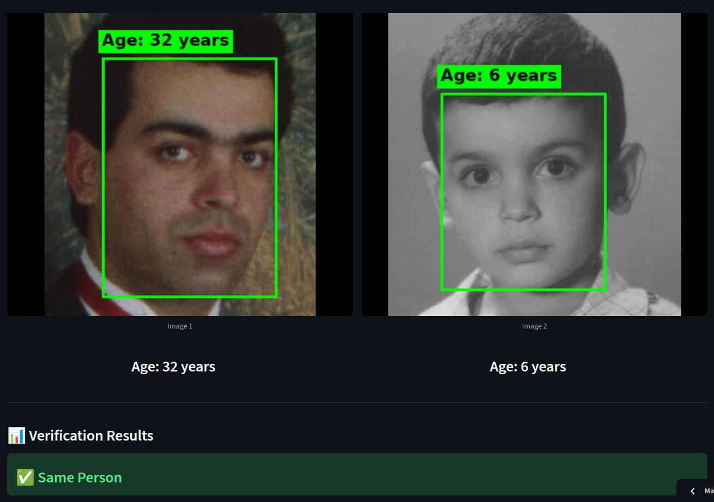
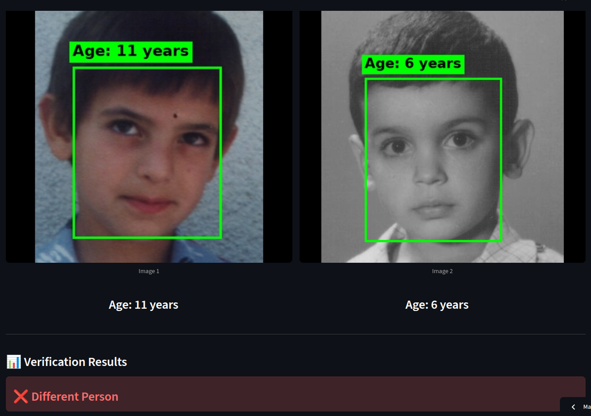

# Age-Invariant Face Recognition App

<em>The **Age-Invariant Face Recognition System** is a **Streamlit-based web application** that verifies if two face images belong to the same person, regardless of age differences.  
It uses **InsightFace (buffalo_l)** for robust face detection and recognition, with **age-adaptive thresholds** optimized for different age gaps, and includes **Vision Transformer (ViT)** for age prediction capabilities.</em><br>

[](https://age-variant-face-matching-system.streamlit.app/)

<div align="center">
  
  
</div>

---

## Quick Setup & Usage

### Run the Web App Locally

```bash
# Install dependencies
pip install -r streamlit_app/requirements.txt

# Run the app
streamlit run streamlit_app/app.py
```

Visit `http://localhost:8501` and upload two face images to verify if they belong to the same person.

---

## 🔬 Reproduce Training Results

To reproduce the model training experiments on MORPH, AgeDB, CACD, and FG-NET datasets:

1. **Preprocess Datasets**: Run `assets/1-morph-cacd-agedb-fgnet-dataset-preprocessing.ipynb`
2. **Generate Pairs**: Run `assets/2-create-pairs-dataset-processing.ipynb` (uses output from step 1)
3. **Train Model**: Run `assets/3-AQUAFace-Training.ipynb` (uses output from step 2)

These notebooks fine-tune and evaluate the base **R100_Glint360K** model on age-specific datasets (AgeDB + Morph + CACD + Fgnet).

**Training Framework**: [AQUAFace Repository](https://github.com/sadiqebrahim/AQUAFace)

---